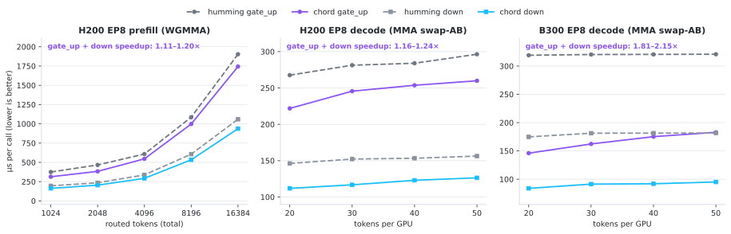

<!-- markdownlint-disable MD001 MD033 MD041 -->
<p align="center">
  <picture>
    <source media="(prefers-color-scheme: dark)" srcset="docs/assets/logo_lockup_dark.svg">
    
  </picture>
</p>

<h3 align="center">
Novita Labs' production MoE CUDA kernel
</h3>

<p align="center">
| <a href="#documentation"><b>Documentation</b></a> | <a href="https://novita.ai"><b>Novita AI</b></a> | <a href="https://blogs.novita.ai"><b>Blog</b></a> |
</p>

---

Chord (Python package `chord_kernels`) is Novita Labs' in-house W4A16 MoE CUDA
operator — BF16 activation, INT4 weight, group-32 scale — built for serving the
Kimi K2.5 family (K2.5/K2.6/K2.7), the main open-weight LLM family shipping
INT4 weights.

## Supported configurations

| Interface | GPU | Compute capability | Scenario | Profile |
| --- | --- | --- | --- | --- |
| `indexed` | Hopper (H200) | SM90 (9.0) | Prefill, EP8 | `h200_prefill_ep8` |
| `indexed` | Hopper (H200) | SM90 (9.0) | Single-instance (mix), TP8 | `h200_tp8` |
| `indexed` | Hopper (H200) | SM90 (9.0) | Decode, EP8 | `h200_decode_ep8` |
| `indexed` | Blackwell (B200/B300) | B200: SM100 (10.0); B300: SM103 (10.3) | Decode, EP8 | `blackwell_decode_ep8` |
| `contiguous`, `masked` | Hopper (H200) | SM90 (9.0) | EP8/EP16/EP32 | To be released — H200 `masked` vs public Humming: 1.2–1.4x (EP16), 1.5–1.7x (EP32) |

## Performance

Per-call latency against the public Humming `indexed` path; on SM100/SM103
public Humming ships only its default config strategy. Full tables are in
[docs/performance.md](docs/performance.md).

<picture>
  <source media="(prefers-color-scheme: dark)" srcset="docs/assets/benchmark_chart_dark.svg">
  
</picture>

## Installation

```bash
pip install git+https://github.com/novitalabs/chord.git
```

## Quick start

```python
import torch

from chord_kernels import indexed
from chord_kernels.operator import pack_w4a16

weight = torch.randint(
    0, 16, (num_experts, n, k), dtype=torch.int32, device="cuda"
).contiguous()
scale = torch.ones(
    (num_experts, n, k // 32), dtype=torch.bfloat16, device="cuda"
).contiguous()
packed = pack_w4a16(weight, scale, layout="mma")

output = indexed(
    inputs, packed, sorted_ids, expert_ids, num_tokens_padded, top_k
)
# down projection: inputs are the already-routed (top_k-expanded) activations,
# so call with top_k=1
```

The full API surface — packing layouts, the routing contract, the layer adapter
for framework integration and per-instance P/D role selection — is in
[docs/getting_started.md](docs/getting_started.md).

## Documentation

- [docs/getting_started.md](docs/getting_started.md) — JIT cache, low-level
  API, routing contract, layer adapter, tests.
- [docs/performance.md](docs/performance.md) — the measured tables behind the
  chart above.
- [docs/optimizations.md](docs/optimizations.md) — what the three published
  scenarios changed relative to the public Humming baseline, with measurements.
- [docs/tuning.md](docs/tuning.md) — instruction paths, block-M model, the
  2-CTAs/SM window, and the stream-K reduction.
- [docs/benchmarking.md](docs/benchmarking.md) — timing methods, `cos_diff`, and
  reading TFLOPS/GB-s.
- [docs/shapes.md](docs/shapes.md) — Kimi K2.5 EP8 and TP8 shape derivation,
  token-count scoping, routing distribution, and the gate/up vs down contract.

## Provenance and license

This repository derives from the public `inclusionAI/humming` commit
[`4351af3a8fcdce1a8dee50104ba49566af2427fb`](https://github.com/inclusionAI/humming/commit/4351af3a8fcdce1a8dee50104ba49566af2427fb);
"based on Humming" describes source lineage, not a runtime dependency. The
extraction scope, W4A16 modifications and retained files are listed in
[chord_kernels/operator/SOURCE.md](chord_kernels/operator/SOURCE.md). The
upstream Apache-2.0 license text is in
[chord_kernels/operator/LICENSE](chord_kernels/operator/LICENSE); the repository
as a whole is Apache-2.0.
